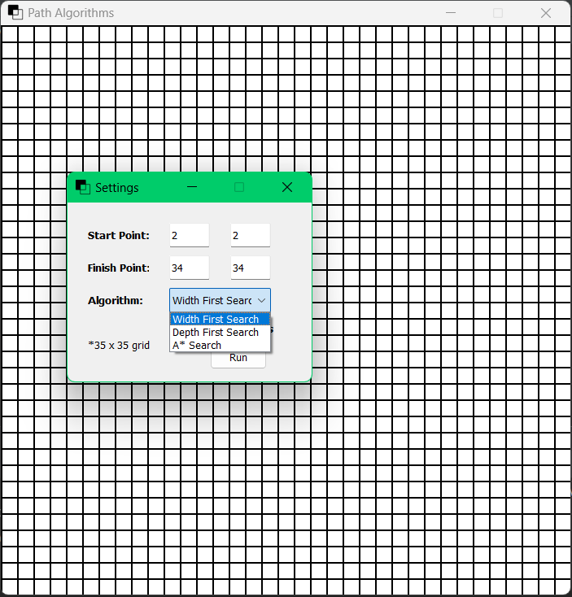
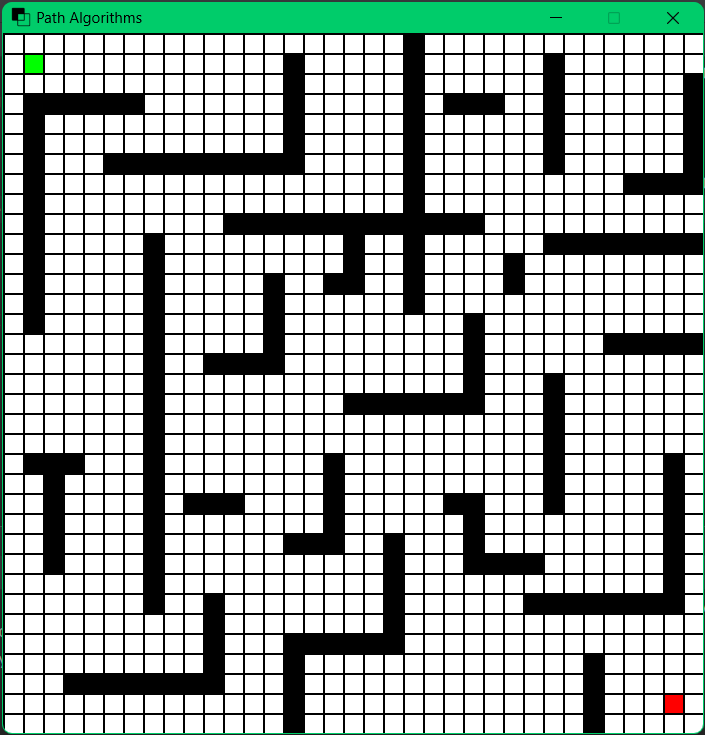
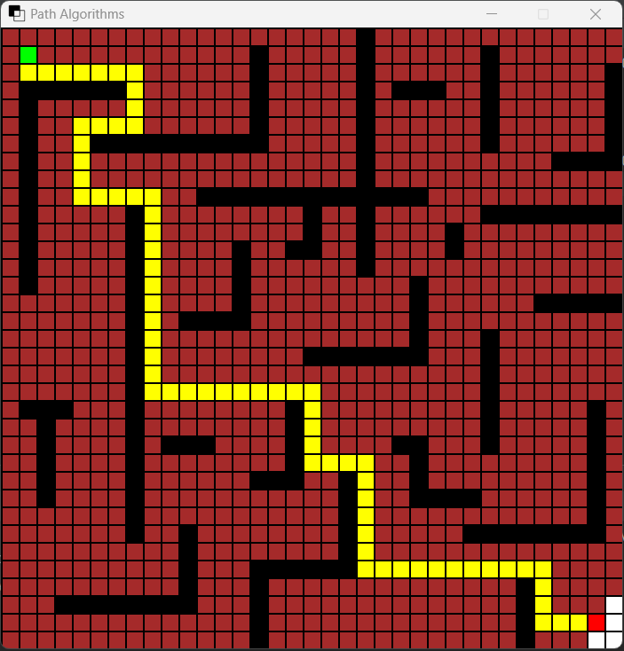
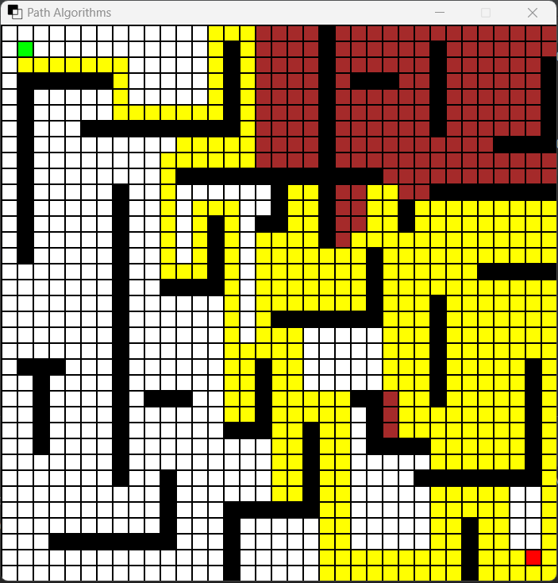
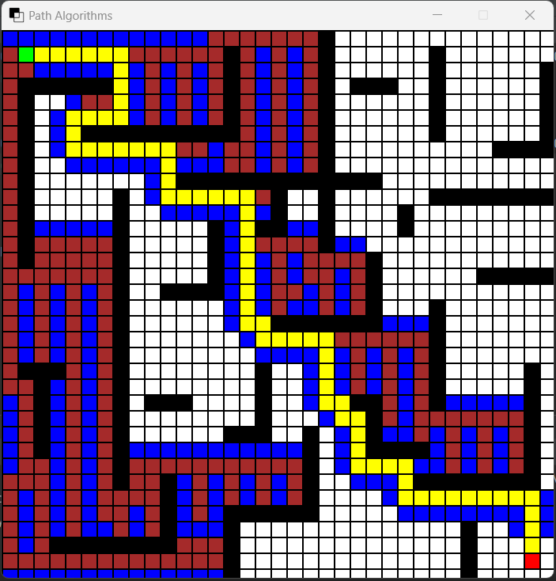

# Path Finding Algorithms
<br>
This is a pathfinding algorithm visualization program built with Python. It allows users to interactively visualize the process of finding a path between a start and end point on a grid. The program supports various pathfinding algorithms such as Breadth First Search, Depth First Search, and A*.
## Features
- Interactive grid-based interface with a 35x35 grid window using Pygame.
- User can specify the start and end points on the grid.
- Ability to select the pathfinding algorithm (Breadth First Search, Depth First Search, A*).
- Option to visualize the step-by-step process of the algorithm or skip to the final path.
- User can block cells on the grid to create a custom maze.
- Visual representation of the algorithm's progress and the final path.
## Screenshots
<br>
*Custom Maze*<br><br>
<br>
*Breadth First Search*<br><br>
<br>
*Deapth First Search*<br><br>
<br>
*A-star Search*
## Installation
To run the Morse Code Converter locally, follow these steps:
1. Clone the repository:<br>
   ```git clone [repository_url]```
3. Install the required dependencies:<br>
   ```pip install -r requirements.txt```
5. Run the application:<br>
   ```python main.py```
## Usage
1. Launch the program by running the main script.
2. A user-friendly window will appear, allowing you to set up the start and end points and select the pathfinding algorithm.
3. Setting up the grid:
   - Click on the start or end position to reposition those points.
   - Drag your mouse across the cells to mark them as obstacles.
4. Press the Enter key to start the pathfinding algorithm and visualize the process.
5. If you opted to see the steps, the program will display each step of the algorithm.
6. Finally, a new window will show the number of steps it took to reach the destination.
## Contributing
If you would like to contribute to this project, please read the [Contribution Guidelines](https://github.com/blubu/path-finder/blob/main/contribution_guidelines.md) for more information. The guidelines contain areas where improvements are sought, as well as additional features that could be implemented. Feel free to add your own ideas or suggest improvements.For detailed instructions on recreating this project, please refer to the [steps.md](https://github.com/blubu/path-finder/blob/main/steps.md) file.
## Contact
If you have any questions, suggestions or need further assistance, feel free to reach out to me at vibhu13github@gmail.com.
